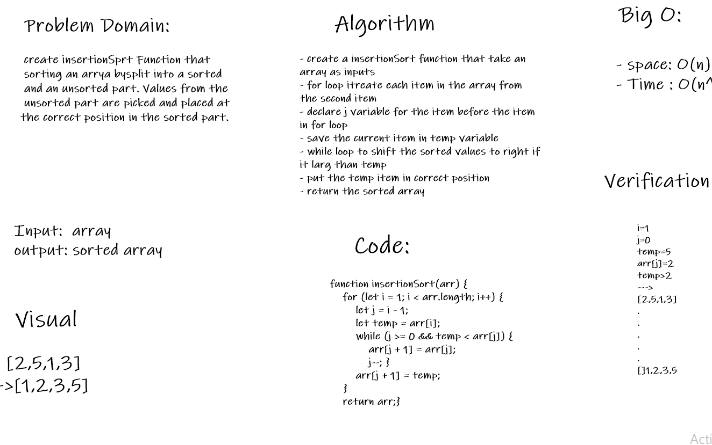

# Challenge Summary
 
Insertion sort is a simple sorting algorithm .The array is virtually split into a sorted and an unsorted part. Values from the unsorted part are picked and placed at the correct position in the sorted part.
## Challenge Description
the most challenge is How to split into a sorted and an unsorted part. Values from the unsorted part are picked and placed at the correct position in the sorted part.
## Approach & Efficiency
- create a insertionSort function that take an array as inputs
- for loop itreate each item in the array from the second item
- declare j variable for the item before the item in for loop
- save the current item in temp variable 
- while loop to shift the sorted values to right if it larg than temp 
- put the temp item in correct position
- return the sorted array
#### Big O:
- space: O(n)
- Time : O(n^2)
## Solution
