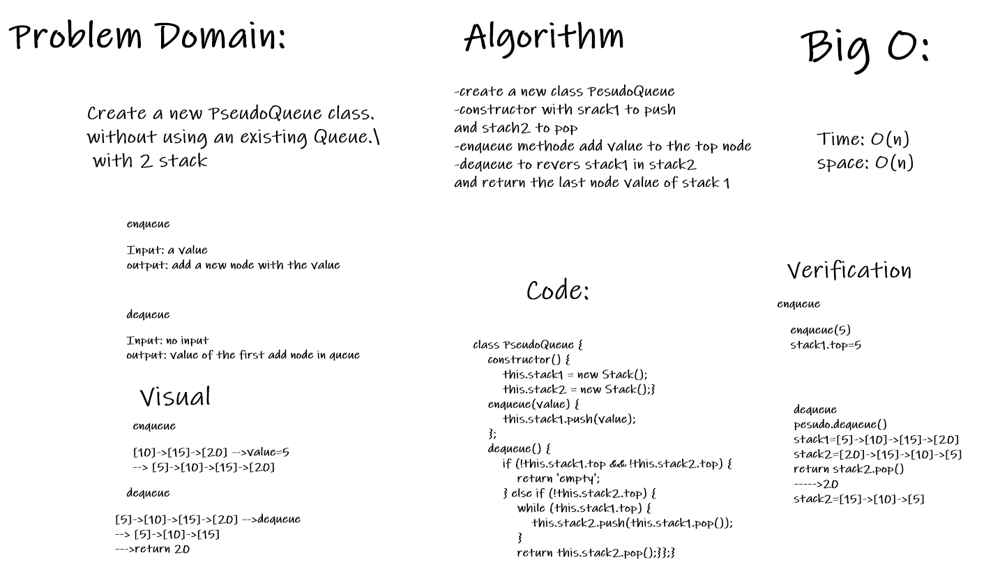

# Challenge Summary
Queue with stack

## Challenge Description
Create a new PseudoQueue class. 
without using an existing Queue.
 with 2 stack

## Approach & Efficiency
- create a new class PesudoQueue
- constructor with srack1 to push
and stach2 to pop
- enqueue methode add value to the top node
- dequeue to revers stack1 in stack2
and return the last node value of stack 1
B

- ### Big O
 - Time: O(n)
 - Space: O(n)
## Solution
