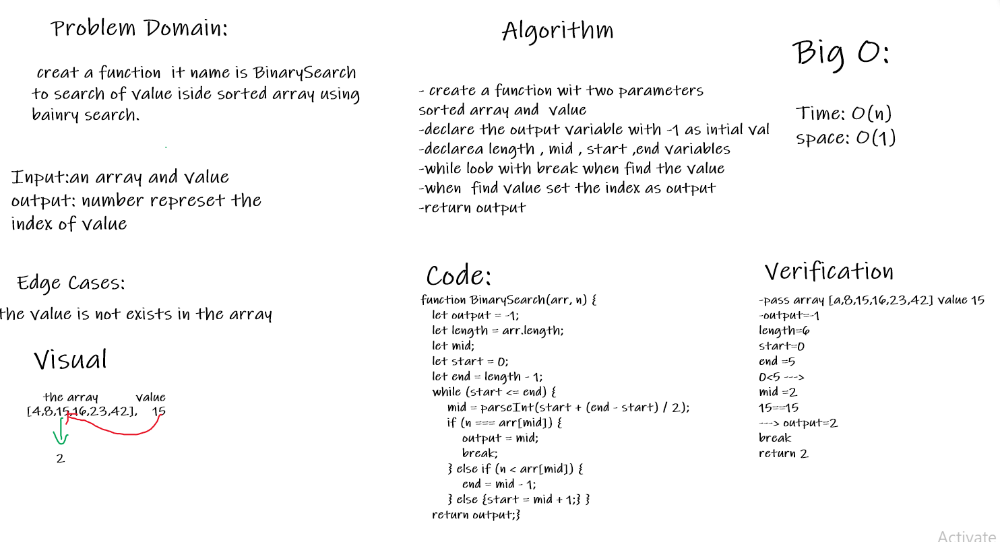

# Challenge Summary
 creat a function  it name is BinarySearch 
to search of value iside sorted array using 
bainry search.
## Challenge Description
Binary search compares the target value to the middle element of the array. If they are not equal, the half in which the target cannot lie is eliminated and the search continues on the remaining half, again taking the middle element to compare to the target value, and repeating this until the target value is found. If the search ends with the remaining half being empty, the target is not in the array.
## Approach & Efficiency
create a function wit two parameters
sorted array and  value
- declare the output variable with -1 as intial val
- declarea length , mid , start ,end variables
- while loob with break when find the value
- when  find value set the index as output
- return output

### Big O
- Time: O(n)
- space O(1)

## Solution
