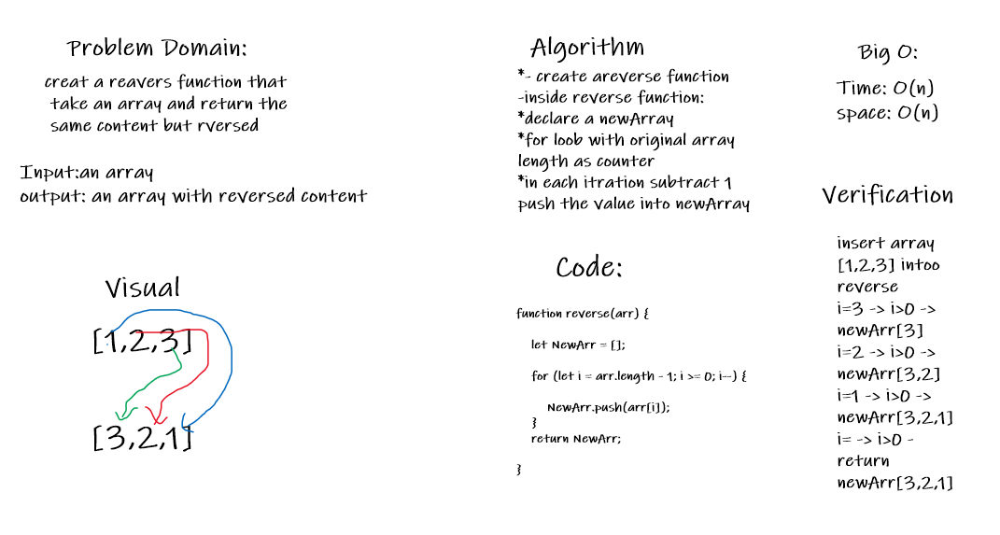

# Reverse an Array
reverseArray which takes an array as an argument,return an array with elements in reversed order.

## Challenge
the most challenge how to reverse element inside the array without built-in method

## Approach & Efficiency
creat a reavers function that take an array and return the same content but rversed
Big O
Time: O(n)
space: O(n)
## Solution
