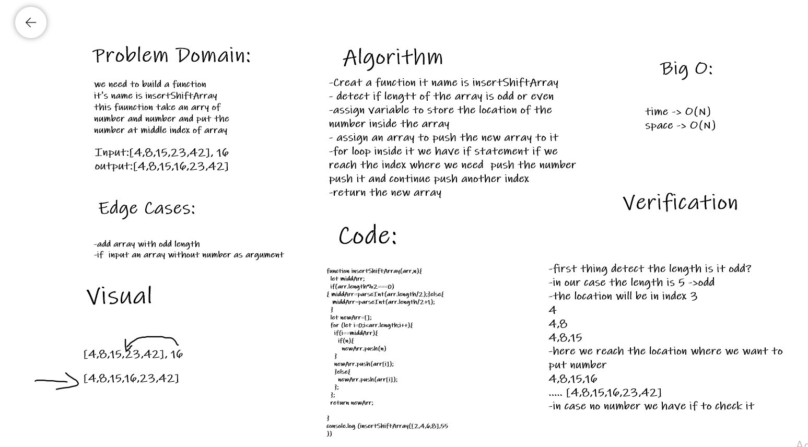

# Challenge Summary
insertShiftArray

## Challenge Description
we need to build a function
it's name is insertShiftArray
this fuunction take an arry of number and number and put the number at middle index of array

## Approach & Efficiency
build a function with for loob and if condition
## Solution
- Creat a function it name is insertShiftArray
- detect if lengtt of the array is odd or even
- assign variable to store the location of the number inside the array
- assign an array to push the new array to it
- for loop inside it we have if statement if we reach the index where we need  push the number push it and continue push another index
- return the new array
