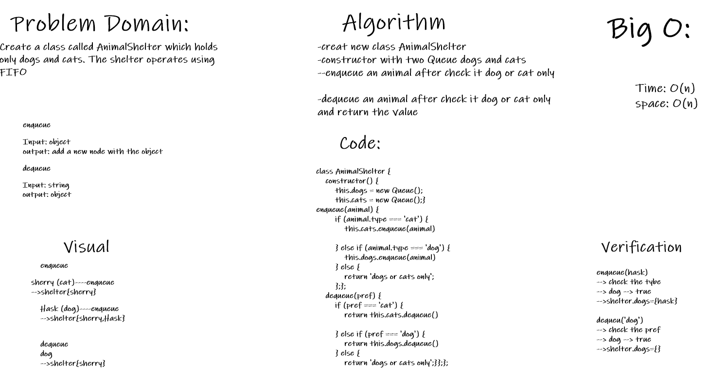

# Stacks and Queues
create AnimalShelter class

## Challenge
Create a class called AnimalShelter which holds only dogs and cats. The shelter operates using FIFO
## Approach & Efficiency
- creat new class AnimalShelter
- constructor with two Queue dogs and cats
- enqueue an animal after check it dog or cat only

- dequeue an animal after check it dog or cat only
and return the value
- Big O
 - Time : O(n)
 - space : O(n)

- ## API

 - dequeue:  remove an animal after check 

 - enqueue: add a new animal after check.

 ## solution
 
