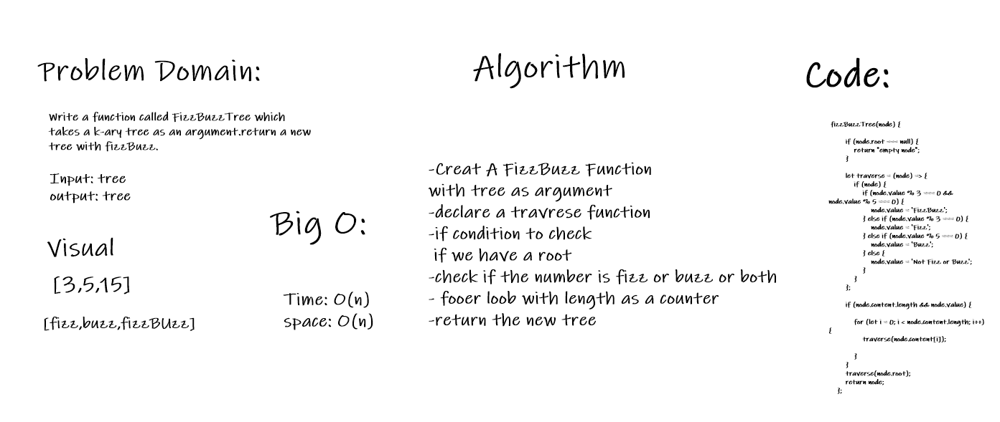

# Challenge Summary
FizzBuzzTree function

## Challenge Description
Write a function called FizzBuzzTree which takes a k-ary tree as an argument.return a new tree with fizzBuzz.
## Approach & Efficiency
- Creat A FizzBuzz Function 
with tree as argument
- declare a travrese function
- if condition to check
 if we have a root
- check if the number is fizz or buzz or both
- fooer loob with length as a counter
- return the new tree
## Big O:
- Time: O(n)
- space: O(n)
## Solution
