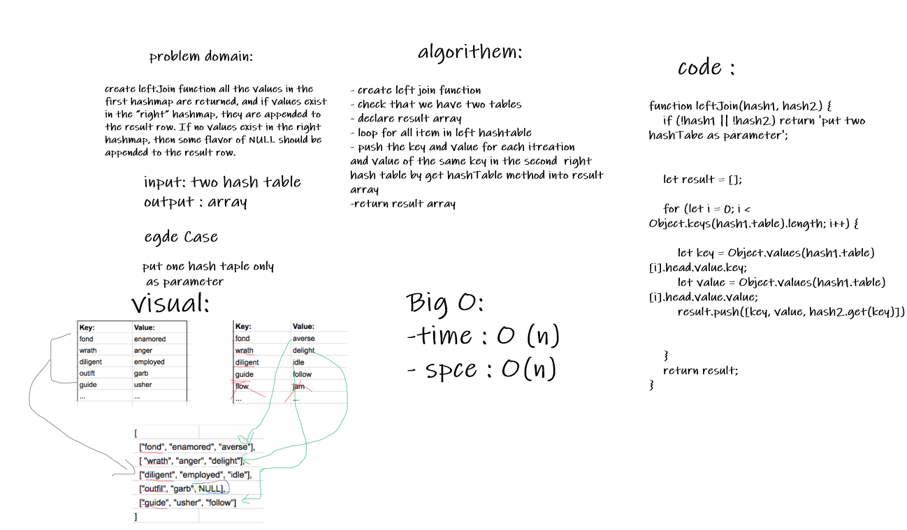

# Challenge Summary
create leftJoin function all the values in the first hashmap are returned, and if values exist in the “right” hashmap, they are appended to the result row. If no values exist in the right hashmap, then some flavor of NULL should be appended to the result row.## Challenge Description
Createa a merge Sort Function that take  array
and return sorted array
## Approach & Efficiency
- create left join function
- check that we have two tables
- declare result array
- loop for all item in left hashtable
- push the key and value for each itreation 
and value of the same key in the second  right 
hash table by get hashTable method into result array
- return result array
### Big O:
- time : O (n)
- spce : O(n)
## Solution
