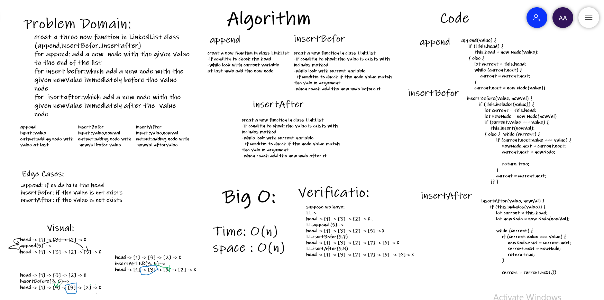
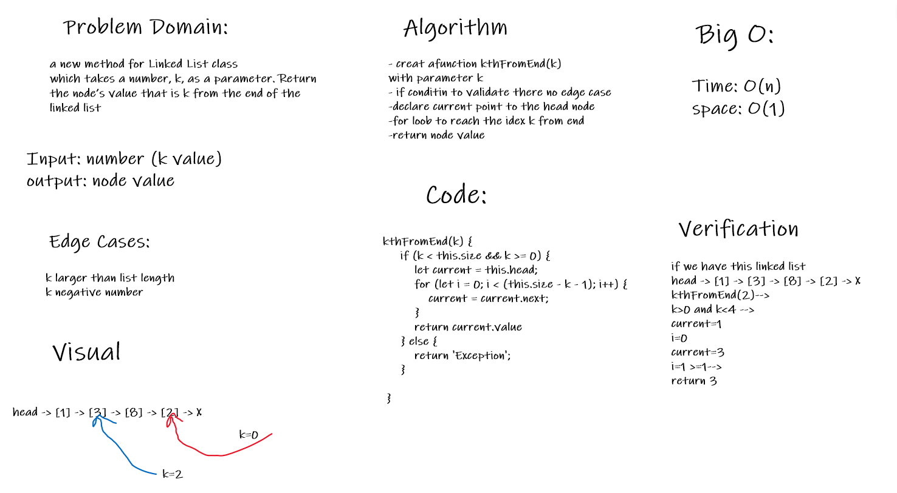

# Singly Linked List
Singly linked list: the collection of ordered set of elements. The number of elements may vary according to need of the program. A node in the singly linked list consist of two parts: data part and link part. Data part of the node stores actual information that is to be represented by the node while the link part of the node stores the address of its immediate successor.
## Challenge
how to create the function satisfy the requirement for LinkedList class as includes.
## Approach & Efficiency
create to classes NOde and linkedList and in LinkesdList class we have a constructor ad three functions (isersts, includes, toString)
and each function do specific approach 
#### Big O
- time: O(n)
- space: O(n)
## API
- insert() : function add a new nodes into the head of linked list.
- includes(value): function check if have the value in the linked list.
-  toString(): function will print all the values inside the linked list
- append(value):add a new  node with the given value to the end of the list
- insertBefor(value,newVal):which add a new node with the given newValue immediately before the value node
- insertAfter(value,new val):which add a new node with the given newValue immediately after the value node
- kthFromEnd(k) : Return the node’s value that is k from the end of the linked list

-

## Code Challenge 7 WB

-

