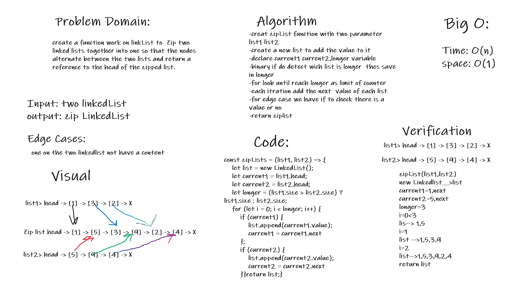

# ZipList function
create a function work on linkList to  Zip two linked lists together into one so that the nodes alternate between the two lists and return a reference to the head of the zipped list. 
## Challenge
Given two linked lists, insert nodes of second list into first list at alternate positions of first list.
## Approach & Efficiency
-creat zipList function with two parameter
list1 list2
-create a new list to add the value to it
-declare current1 current2,longer variable
-binary if do detect wich list is longer  thes save in longer
-for loob until reach longer as limit of counter
-each itration add the next  value of each list
-for edge case we have if to check there is a value or no 
-return ziplist
#### Big O
- time: O(n) 
- space: O(1)

