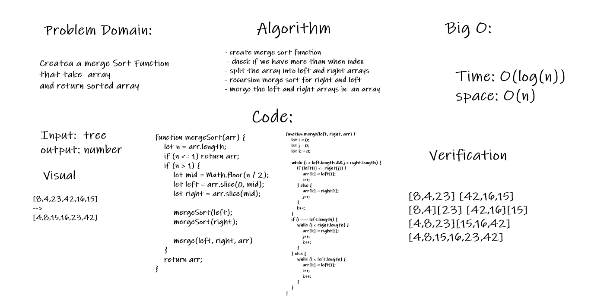

# Challenge Summary
merge sort algrothim
## Challenge Description
Createa a merge Sort Function that take  array
and return sorted array
## Approach & Efficiency
- create merge sort function
- check if we have more than when index
- split the array into left and right arrays
- recursion merge sort for right and left
- merge the left and right arrays in  an array
# Big O:
- Time: O(log(n))
- space: O(n)
## Solution
