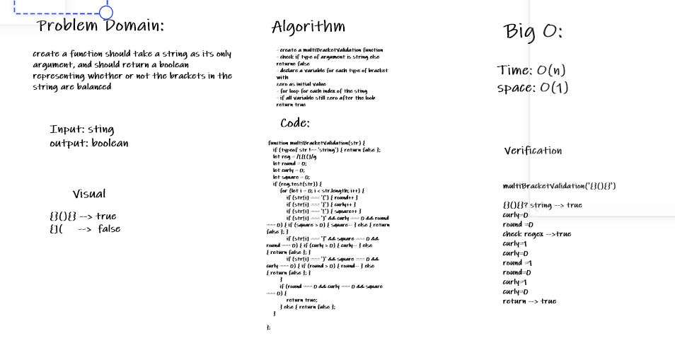

# Challenge Summary
check if the string contain only closed brackets

## Challenge Description
create a function should take a string as its only argument, and should return a boolean representing whether or not the brackets in the string are balanced
## Approach & Efficiency
- create a multiBracketValidation function
- check if type of argument is string else 
returne false
- declare a variable for each type of bracket  with
zero as initial value
- for loop for each index of the sting 
- if all variable still zero after the loob
return true
 #### Big O
 - Time : O(n)
- space : O(1)
## Solution
