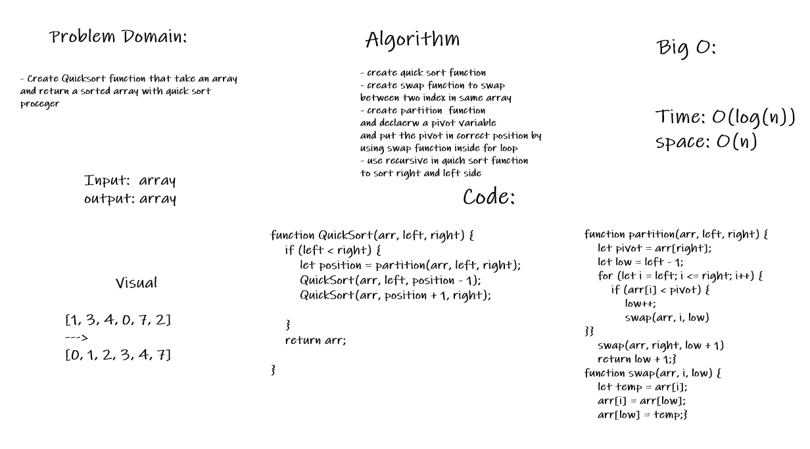

# Challenge Summary
- Create Quicksort function that take an array and return a sorted array with quick sort proceger

## Approach & Efficiency
- create quick sort function
- create swap function to swap 
between two index in same array
- create partition  function
and declaerw a pivot variable
and put the pivot in correct position by
using swap function inside for loop
- use recursive in quich sort function 
to sort right and left side
## Big O
- time: O(log(n))
- space: O(n)
## Solution
- QuickSort(arr,left,right)
- example:> QuickSort([3,1,2],0,2)--->[1,2,3]
## Whiteboard Process
