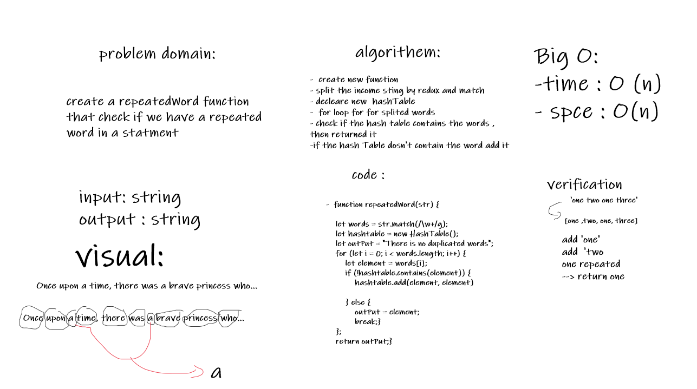

# Challenge Summary
create a repeatedWord function 
that check if we have a repeated 
word in a statment

## Approach & Efficiency
-  create new function
- split the income sting by redux and match
- decleare new  hashTable
-  for loop for for splited words 
- check if the hash table contains the words , then returned it
- if the hash Table dosn't contain the word add it
#### Big O:
- time : O (n)
- spce : O(n)

## Whiteboard Process
