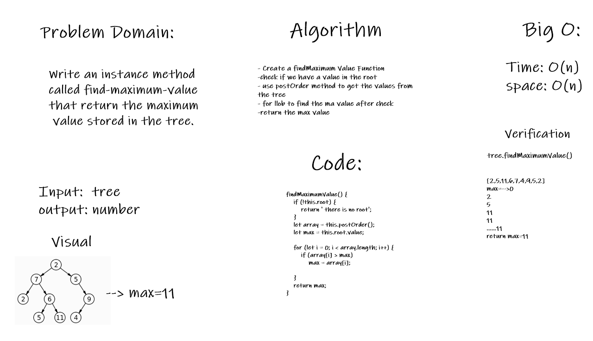

# Trees
A tree whose elements have at most 2 children is called a binary tree. Since each element in a binary tree can have only 2 children, we typically name them the left and right child

## Challenge
- Define a method named add that accepts a value, and adds a new node with that value in the correct location in the binary search tree.
- Define a method named contains that accepts a value, and returns a boolean indicating whether or not the value is in the tree at least once.

## Approach & Efficiency
- add method: adding a value to the tree after checking the root.
- contains method: return true if the tree contain the value after searching.
## API

- preOrder: Root - Left - Right. 
- inOrder : left - Root - Right. 
- postOrder: Root - Left - Right. 
- add method: add a value to the tree
- contains method: return true if the tree contain the value.

# CC16 FindMaxValue

### Challenge Summary
- Find the max value in the tree 
### Challenge Description
Write an instance method called find-maximum-value 
that return the maximum value stored in the tree.
### Approach & Efficiency
- Create a findMaximum Value Function
-check if we have a value in the root
- use postOrder method to get the values from 
the tree
- for loob to find the ma value after check
- return the max value
### Big O:
- Time: O(n)
- space: O(n)
### Solution
