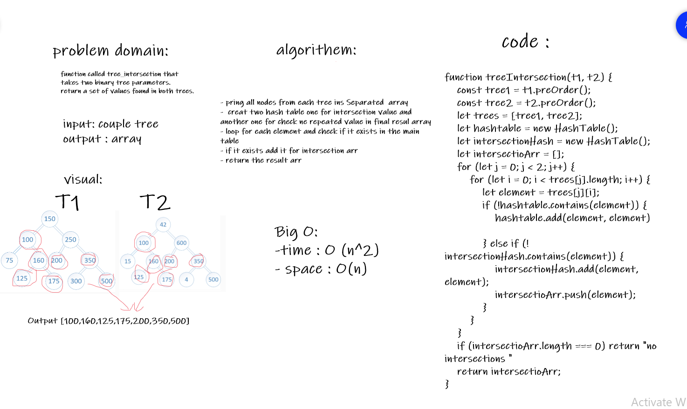

# Challenge Summary
function called tree_intersection that 
takes two binary tree parameters.
return a set of values found in both trees.

## Approach & Efficiency
- pring all nodes from each tree ins Separated  array
-  creat two hash table one for intersection value and another one for check ne repeated value in final resul array
- loop for each element and check if it exists in the main table
- if it exists add it for intersection arr
- return the result arr
### Big O:
-time : O (n^2)
- space : O(n)
## Whiteboard Process
